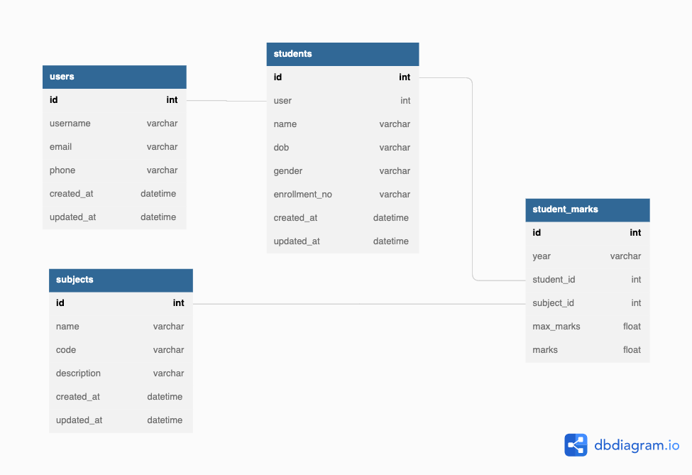

## Description

Student Performance System - Project Perfometer

### Features
- Store the student's detail, subject's detail and their marks in each subject.
- Login using a username password followed by JWT Authentication.
- A student can get details of their performance along with the overall highest scorer and also individual subject's highest scorer

### Tech Stack and Integrations

- **Nestjs** (Typescript Framework)
- **db** postgresql
- JWT Authentication
- OpenApi Swagger


## Installation

```bash
$ npm install
```

## Running the app
> **_Note_** create a .env file in root directory

.env
```
DB_HOST=
DB_PORT=
DB_USER=
DB_PASSWORD=
DB_NAME=
JWT_SECRET=
```
```bash
# development
$ npm run start

# watch mode
$ npm run start:dev

# production mode
$ npm run start:prod
```

# DB Schema



# Project Structure
```
.
├── auth
├── core
├── students
├── subjects
├── users
├── app.controller.spec.ts
├── app.controller.ts
├── app.module.ts
├── app.service.ts
└── main.ts
```

# APIs by Swagger

```
http://localhost:3000/api
```
